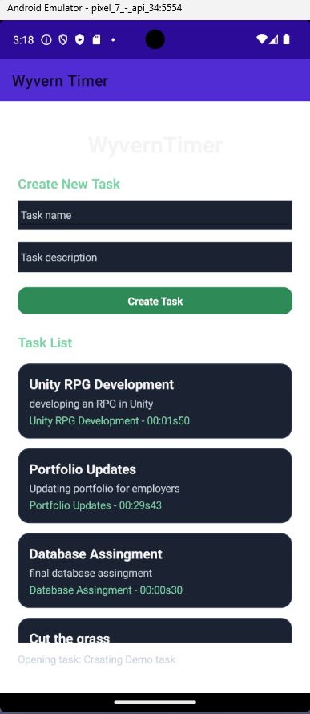
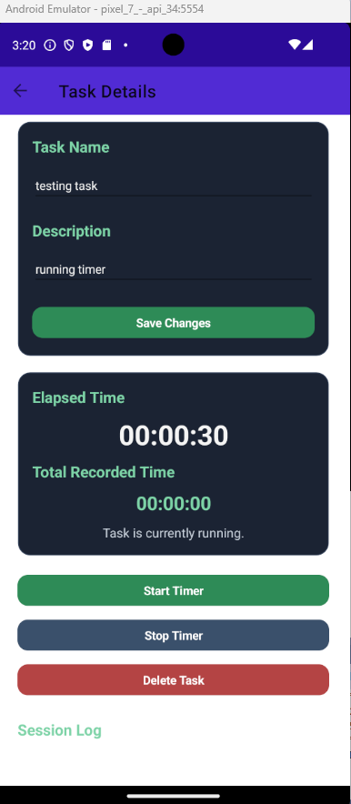
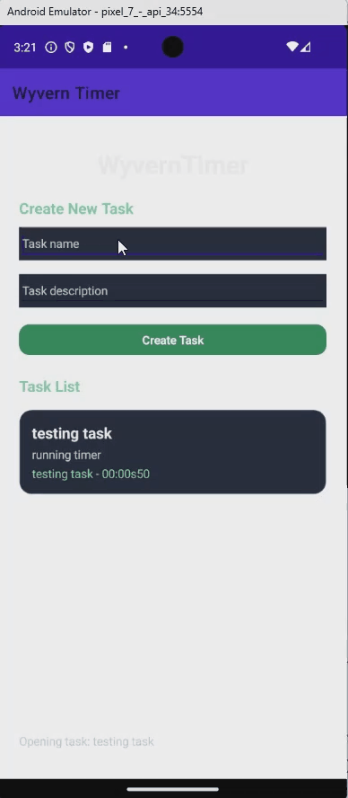
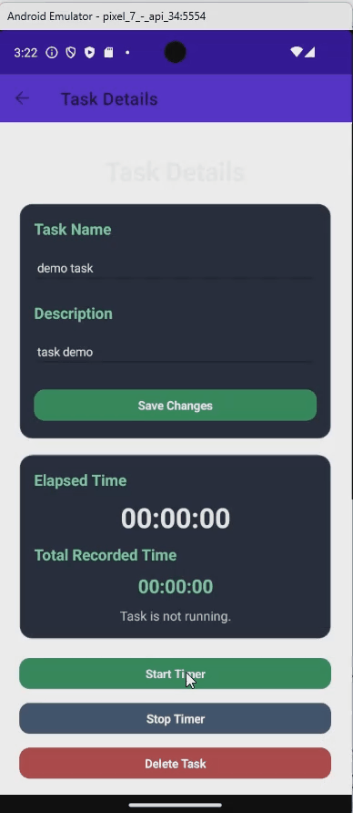

# WyvernTimer

WyvernTimer is a task-focused time-tracking application built with C# and .NET MAUI. It allows users to create tasks, record multiple work sessions, add summaries to completed sessions, and track the total time spent on each task.

The project was developed as an individual application project and was designed to provide a simple way to record both time and progress across multiple work sessions.

## Features

* Create and edit tracked tasks
* Start and stop a live timer for individual tasks
* Save multiple timing sessions under each task
* Record a summary for each completed session
* Calculate the total accumulated time for each task
* Review previous sessions from a dedicated task view
* Retain task and session data between application launches
* Store application data locally using JSON

## Screenshots

### Task List



### Task Details and Session History




## Demonstration

### Creating a Task



### Recording a Work Session



## Technologies

* C#
* .NET MAUI
* XAML
* JSON
* Local file storage
* Visual Studio

## Data Storage

WyvernTimer saves task data locally in a JSON file located in the application's data directory.

```csharp
_filePath = Path.Combine(
    FileSystem.AppDataDirectory,
    "tasks.json"
);
```

This allows tasks, accumulated time, session history, and session summaries to remain available after the application is closed.

## Project Structure

The application separates its task data, storage operations, user-interface pages, and supporting logic into dedicated classes and folders.

Key components include:

* Task data models
* Session data models
* JSON storage service
* Task list interface
* Individual task views
* Timer controls
* Task creation and editing interfaces

## What I Learned

Developing WyvernTimer strengthened my experience with:

* Building a cross-platform application with .NET MAUI
* Creating user interfaces with XAML
* Managing application state across multiple screens
* Implementing a live timer
* Persisting nested application data in JSON
* Restoring saved data when the application launches
* Calculating accumulated time across multiple sessions
* Designing application features around reusable models and services

One of the central challenges was ensuring that active and completed timing sessions were recorded accurately while keeping each task's total time synchronized with its session history.

## Running the Project

### Requirements

* Visual Studio 2022
* .NET MAUI workload
* A supported Android emulator, Android device, or Windows development environment

### Setup

1. Clone the repository.

```bash
git clone https://github.com/YOUR-USERNAME/WyvernTimer.git
```

2. Open the solution in Visual Studio.

3. Restore any required NuGet packages.

4. Select a supported target device.

5. Build and run the application.

## Future Improvements

Potential future additions include:

* Task categories and tags
* Search and filtering
* Daily and weekly time summaries
* Data visualization
* Exporting task and session data
* Cloud synchronization
* Improved validation and error handling
* Additional interface customization

## Author

**Nicholas Di Giacomo**

Computer Programming graduate with experience developing applications using C#, Java, .NET MAUI, Android Studio, relational databases, and local data persistence.
